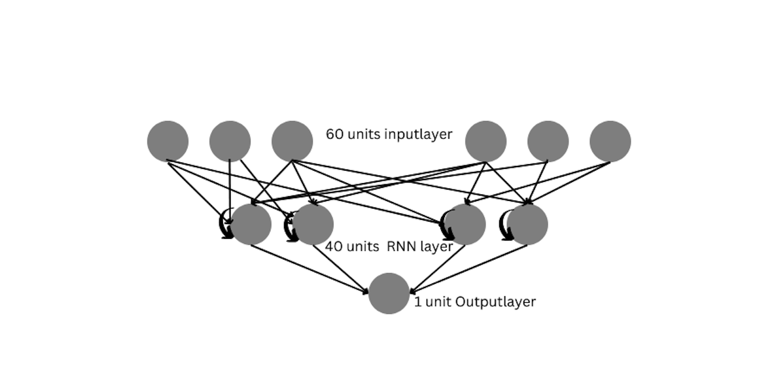
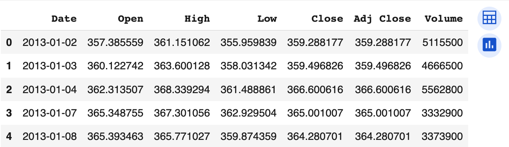
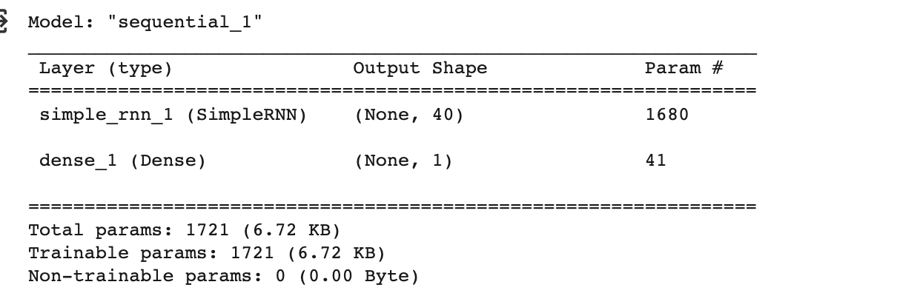
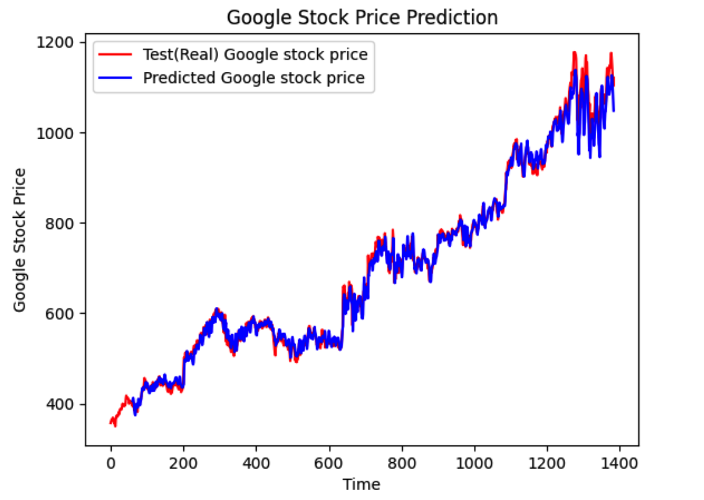
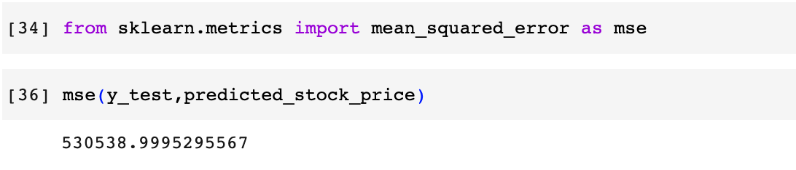

# Stock Price Prediction

## AIM

To develop a Recurrent Neural Network model for stock price prediction.

## Problem Statement and Dataset
Predicting the Google stock price over time is the assigned challenge.
For this, a dataset is given to us that includes information such as Date, Opening Price, Highest Price, Lowest Price, Closing Price, Adjusted Closing Price, Volume, and many more.
Create an RNN model to forecast the price of stocks based on the provided features.

## Neural Network Model

## DESIGN STEPS

### STEP 1: 
Import the require modules

### STEP 2: 
Import the dataset to manipulate on

### STEP 3: 
Assign the training and testing set

### STEP 4: 
Scale the data

### STEP 5: 
Create the model

### STEP 6: 
Compile and fit the model

### STEP 7: 
Make the prediction using testing data 

## PROGRAM
~~~
Developed by: Manoj CHoudhary V
Reg no: 212221240025
~~~
## Importing the required packages
~~~
import numpy as np
import matplotlib.pyplot as plt
import pandas as pd
from sklearn.preprocessing import MinMaxScaler
from keras import layers
from keras.models import Sequential
~~~

## Importing the dataset
~~~
dataset_train = pd.read_csv('trainset.csv')
~~~
## Assigning the training set
~~~
dataset_train.columns
dataset_train.head()
train_set = dataset_train.iloc[:,1:2].values
type(train_set)
train_set.shape
~~~
## Scaling the data
~~~

sc = MinMaxScaler(feature_range=(0,1))
training_set_scaled = sc.fit_transform(train_set)
training_set_scaled.shape
~~~
## Assign the range of the training set to be taken  
~~~

X_train_array = []
y_train_array = []
for i in range(60, 1259):
  X_train_array.append(training_set_scaled[i-60:i,0])
  y_train_array.append(training_set_scaled[i,0])
X_train, y_train = np.array(X_train_array), np.array(y_train_array)
X_train1 = X_train.reshape((X_train.shape[0], X_train.shape[1],1))
X_train.shape
~~~
## Assigning the length and number of features
~~~

length = 60
n_features = 1
~~~
## Creating the model
~~~
model = Sequential()
model.add(layers.SimpleRNN(40,input_shape=(60,1)))
model.add(layers.Dense(1))

~~~
## Compiling the model
~~~
model.compile(optimizer='adam', loss='mse')
model.summary()
~~~
## Fitting the model
~~~
model.fit(X_train1,y_train,epochs=100, batch_size=32)
~~~
## Importing testdata file
~~~
dataset_test = pd.read_csv('testset.csv')
test_set = dataset_test.iloc[:,1:2].values
test_set.shape
~~~
## Concatinating the open of train and test dataset
~~~
inputs = dataset_total.values
inputs = inputs.reshape(-1,1)
inputs_scaled=sc.transform(inputs)
X_test = []
y_test = []
for i in range(60,1384):
  X_test.append(inputs_scaled[i-60:i,0])
  y_test.append(inputs_scaled[i,0])
X_test = np.array(X_test)
X_test = np.reshape(X_test,(X_test.shape[0], X_test.shape[1],1))
~~~
## Scaling the predicting value
~~~
predicted_stock_price_scaled = model.predict(X_test)
predicted_stock_price = sc.inverse_transform(predicted_stock_price_scaled)
~~~
## Plotting the graphs
~~~
plt.plot(np.arange(0,1384),inputs, color='red', label = 'Test(Real) Google stock price')
plt.plot(np.arange(60,1384),predicted_stock_price, color='blue', label = 'Predicted Google stock price')
plt.title('Google Stock Price Prediction')
plt.xlabel('Time')
plt.ylabel('Google Stock Price')
plt.legend()
plt.show()
~~~
## OUTPUT
## Dataset

## Model

### True Stock Price, Predicted Stock Price vs time

### Mean Square Error

## RESULT
There for the a Recurrent Neural Network is successfully developed for stock prediction.
